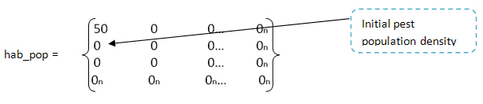
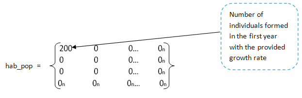
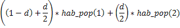
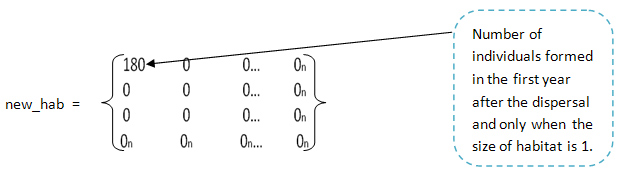
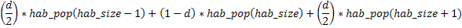
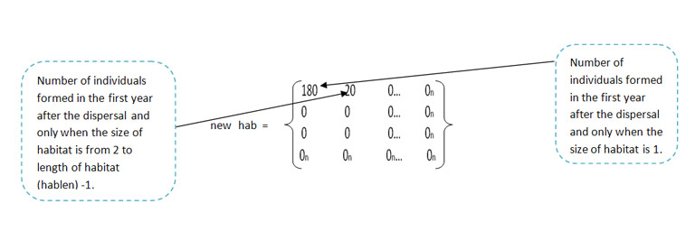
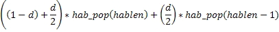
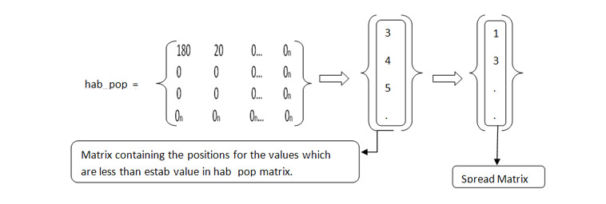

Invasive species is simply defined as non-indigenous species that threatens the diversity or abundance of native species. They disrupt a particular habitat or wild land area by loss of natural controls through their dominant colonization. Certain examples include Asian long horned beetle, freshwater mussel, sea lamprey and rusty crayfish, which explains the concept of population invasion.

#### Characteristics of an invasive species:
 
* Abundant and widely distributed in original range.
* Wide environmental tolerance.
* High genetic variability.
* Short generation time.
* Rapid growth.
* Early sexual maturity.
* High reproductive capacity.
* Broad feeding (opportunistic feeding).
* Gregariousness.
* Natural mechanisms of rapid dispersal.
* Commensal with human activity.

Invasive pest population is one of the serious threats faced in population ecology. Pests are likely to get introduced into an area through transportation and suitable environmental conditions and they start to exploit the resources and spread at a very fast pace. They cause the displacement of the native species of that region due to the competition for the natural resources and food. Sometimes, the displacement of this native species can also be due to the aggressive nature of the pest population making them to abandon their shelters. In addition to this, it also causes the explosion of the natural resources, for eg: the Asian long-horned beetle that originated from China have been known to cause damage to the maple wood trees of North America.

Generally, when an invasive species is introduced into a new area through some transportation media, it starts to feed on a variety of species being one of it's traits i.e., opportunistic feeding. It also breeds at a very fast pace being able to get multiplied in huge numbers in a short generation time. It is also difficult to identify their existence as in the case of the larvae of the Asian long-horned beetle. Considering the specific case of the Asian long-horned beetle, the concept of pest population invasion can be explained in a better way.

The Asian long-horned beetle commonly referred to as “Starry Sky” or “Sky Beetle”, originated mainly from china and the far east regions. It was known to have spread to North America through the wood packing material transported from China in the 1980’s. This pest is a serious threat to many species of deciduous hardwood trees. It is known to bore deep into a tree’s heartwood, where it feeds on the tree’s nutrients eventually leading to the death of the tree due to its tunneling. They are known to make 35 to 90 individual depressions into the host tree’s bark and lays an egg in each of the pits. The eggs hatch in 10 – 15 days and the white caterpillar-like larvae tunnels into the tree’s phloem and cambium layers beneath the tree bark. After several weeks, the larvae tunnel deeper in the tree’s heartwood where they mature into pupae. The pupae hatch into adults inside the tree over the winter months.

&nbsp;

#### Reasons for the successful establishment: 
It was found out that period of transition from the egg to the larval stage is a prolonged one, during which the organism remains virtually invisible.  During this period, it is difficult to detect it and it is easily and inadvertently transported by human activity, especially when using the wood packing materials. Once delivered to a potential colonization site in the temperate zone of North America, a ready supply of host arboreal species is virtually guaranteed. It is often very difficult to find the beetle's hidden passage except for the traces left out like egg deposit borings of emergent adults. In the United States, Asian long horned beetle has no known natural predator i, for any stage of its life cycle. It has been identified that only limited biotic and abiotic factors within the temperate zone of North America to limit the potential.

&nbsp;

#### Effects of its invasion: 
The beetle attacks many different types of hardwood trees, including maple (Norway, sugar, silver, and red), birch, horse chestnut, poplar, willow, elm, ash and black locust. Unlike most cerambycids (long horned beetles) inhabiting the temperate zone, the Asian long horned beetle feeds on both healthy and weakened trees as opposed to the recently dead or dying wood. In addition, unlike most wood-feeding insects inhabiting a living host, the Asian long horned beetle is polyphagous (feeding on many kinds of food) as opposed to monophagous (feeding on one kind of food), feeding on a wide variety of host species. Females oviposit at different locations from exposed roots to the trunks except the smallest branches of the host trees allowing a high concentration of infestation of a single host organism. Asian long horned beetle larvae consumes healthy bark and xylum, making tunnels into the healthy tree which start horizontally and turn upwards to a length of about 10 cm. In great numbers this destruction of the healthy heartwood of the tree first reduce the strength of the host organism and with repeated or continued infestation can lead to its death.

&nbsp;

#### Mathematical Models: 
Mathematical models help us in understanding the dynamics of an invasive species and also they are powerful tools for synthesizing information about invasive species. Although many studies have been conducted on various aspects of invasive species, we still lack the ability to successfully predict three main aspects of biotic invasions: (1) the conditions under which a species will become invasive, (2) the attributes that make some species more invasive than others, and (3) the dynamics of invasions (Mack et al. 2000). Mathematical models can be used to examine these three aspects of an invasive species.

&nbsp;

The rate at which the population spreads depends on the rate of population growth and percentage of the population that disperses. Here, we try to examine the effects of the growth rate and the dispersal rate on the spread of a pest population. To understand the dynamics of the spread of pest population, the below mentioned parameters need to be known.
* Length of habitat.
* Number of years to simulate.
* Initial pest population density.
* Minimum number of individuals needed to establish a population.
* Population growth rate.
* Dispersal rate of the population.

&nbsp;

For the sake of convenience, let us assume that the variables be represented with simpler names like:
* hablen (Length of habitat).
* No (Number of years to simulate).
* estab (Minimum number of individuals needed to establish a population).
* rate (Population growth rate).
* d (Dispersal rate of the population).

&nbsp;

Consider that we are going to study the spread of Asian long horned beetle when the species got introduced into a new area within North America with an initial pest population density, say 50. Let us assume that the conditions were favourable in that environment resulting in the dramatic increase of the population's growth rate and its rapid spread through the hardwood deciduous forests. There were no known natural predators for this beetle except for the limited biotic and abiotic factors within the temperate zone of North America to limit its potential. Let the rate at which this population grows be 4 and the rate of dispersal be 0.2 (assuming that 20% of the population disperse each year). Let the size of the habitat where the population is located be 100 (in kilometers). Now, find what would be the spread of this pest (in kilometers) after 50 years in that habitat after its introduction.

 

Assume that a population in the habitat is represented with hab_pop. This hab_pop is a square matrix containing equal number of rows and columns. The (i,j)th cell in the matrix indicates the number of individuals existing at a particular habitat size and at a particular year. Consider the initial population in the habitat be the initial pest population density. At each time step, with increase in size of the habitat the number of individuals formed can be known by multiplying population growth rate with pest population density in the hab_pop matrix to generate the number of individuals resulting in each year of their spread.

 
&nbsp;

 

Where, n is the length of the habitat. Applying the growth rate of the population, we calculate the number of individuals to be formed in that year. Let habitat_size be represented with hab_size which indicates proportionately increasing habitat size of the habitat.

By using the above equation, we calculate the number of individuals formed in that particular year with that growth rate of the population. After this equation, the matrix looks like this:

 
&nbsp;

Now, we take into account another important factor in the spread of this pest, i.e., dispersal rate of the population represented with d in the equations for simplicity. As previously mentioned the spread of the pest population also depends on dispersal rate. The more the dispersal rate, the more the spread of the pest and if it is controlled the spread of the pest can also be controlled. Taking that into account, in the below equation we calculate the number of individuals after the dispersal as:

 
&nbsp;

After applying the above mentioned equation, let us assume that the number of individuals formed are represented in another population matrix, say new_hab. This matrix is also similar to hab_pop matrix with the same number of rows and columns. This equation is applied only when the size of the habitat is:

 
&nbsp;

Now, apply the below equation to calculate the number of individuals when the habitat size is from 2 to length of habitat (hablen)-1.

 
&nbsp;

After applying the above equation the new_hab matrix looks like this:

 
&nbsp;

Now, let us apply the below equation to calculate the number of individuals when the size of the habitat is equal to length of the habitat.

 
&nbsp;

There would be no individuals formed as indicated in the hab_pop matrix that when the size of the habitat equals the length of the habitat, no individuals would be formed.

 

The above shown results are shown only for the first year of the species establishment. If we want to see the species establishment after 50 years, repeat the above calculations 50 times. And for all the above equations calculate the number of individuals formed each year. But, we would like to see the spread of this pest over a period of time. So, we identify the positions in the hab_pop matrix where the value is less than the value of estab and store it in a matrix. Now, we identify the least value in the available values in the matrix during each run and store it in another matrix named spread. Spread matrix contains an initial value of 1 and during each year it appends the values into it as shown below. This is the matrix used to plot the spread of the pest over a period of time.

 
&nbsp;
So, now we plot the values in the matrix against the number of years. The plot shows us the spread of the pest (in kilometers) over a period of time (in years).

&nbsp;

#### Advantages:
Though there are not much advantages reported due to its devastating effects, yet it helps in "recycling process" by infesting dying or recently dead wood and converting them into potential wood sources for other organisms contributing to soil creation and enrichment.

&nbsp;

#### Disadvantages:
 
The Asian long horned beetle has the potential to cause more damage than Dutch elm disease, chestnut blight, and gypsy moths combined, destroying millions of acres of America's treasured hardwoods, including national forests and backyard trees. The beetle has the potential to damage such industries as lumber, maple syrup, nursery, commercial fruit and tourism accumulating over $41 billion in losses.
 

Asian long horned beetle has the potential to alter North American Ecosystems, due to its tree killing and polyphagous habits and potential for widespread distribution on the continent.